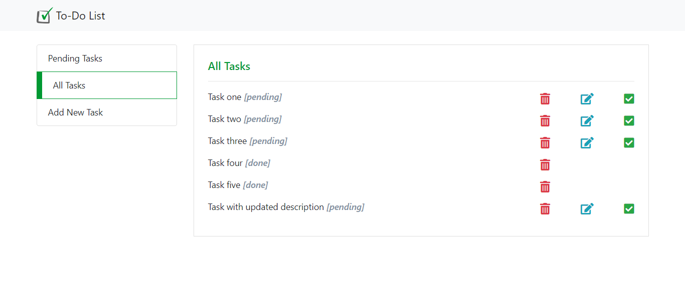

# To-Do List

This project is a To-Do list coded in PHP, JavaScript, MySQL (MariaDB), HTML, CSS and Bootstrap. Details about the features are after the screenshots.

## Screenshot 

## Features

+ View all tasks (***pending*** and ***done***)
+ View pending tasks
+ Mark task as ***done*** (Check icon)
+ Edit task description (Pencil icon)
+ Delete task (Trash icon)
+ Add new task

## Technology Stack

+ PHP
+ JavaScript
+ MariaDB (MySQL)
+ phpMyAdmin
+ XAMPP
+ HTML
+ CSS
+ Bootstrap
